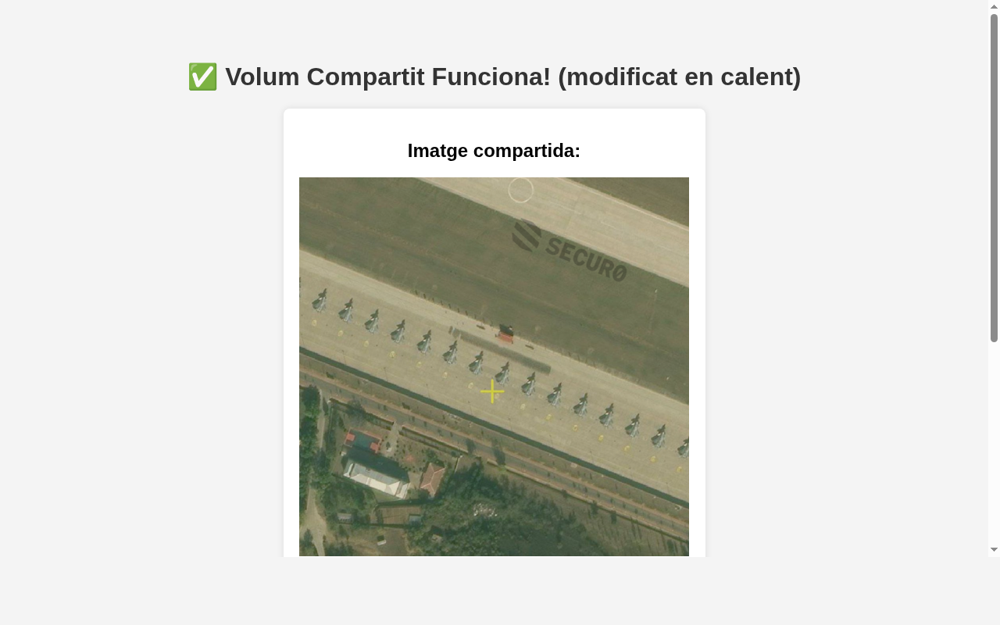

# Pràctica: Proxies amb Nginx (ASIC)

Aquest projecte consisteix en la creació d'una infraestructura web escalable utilitzant Docker Compose, amb dos servidors Apache darrere d'un proxy invers Nginx que realitza balanceig de càrrega i gestió de memòria cau.

## 🚀 Com posar en marxa la infraestructura
Dins de la carpeta del projecte, executa:
```bash
docker-compose up -d
```

---

## 🛠️ Documentació del procés per fases

### Fase 1 i 2: Servidors Apache
S'han configurat dos nodes web basats en la imatge oficial de `httpd` (Apache). Per garantir que podem identificar quin servidor respon a cada petició, el proxy Nginx s'ha configurat per injectar la capçalera `X-Backend-Server`.

### Fase 3: Volum compartit
S'ha creat un volum local vinculat a la carpeta `./html`. Ambdós contenidors Apache munten aquesta carpeta a `/usr/local/apache2/htdocs/`. 
- **Benefici:** Qualsevol canvi en el codi HTML es reflecteix instantàniament en tots els nodes del clúster sense haver de reiniciar els contenidors.

### Fase 4: Proxy invers i Balanceig Round Robin
S'ha utilitzat Nginx com a punt d'entrada únic (port 8080). S'ha definit un bloc `upstream` amb els dos nodes Apache. Per defecte, Nginx utilitza l'algorisme **Round Robin**, distribuint les peticions de forma alterna.

### Fase 5: Memòria cau (Proxy Cache)
S'ha configurat un directori de cache (`/var/cache/nginx`) amb una zona anomenada `my_cache`. 
- **Optimització:** S'ha utilitzat `proxy_ignore_headers` per forçar que Nginx gestioni la cache encara que l'Apache enviï capçaleres de control de cache restrictives, permetent provar el sistema fàcilment.

---

## ⚠️ Problemes trobats i solucions
1. **Vídeo no funcional:** Inicialment s'havia creat un fitxer buit per al vídeo, però el navegador no el reproduïa. S'ha solucionat generant un vídeo de prova real amb `ffmpeg` per verificar que el proxy transmet correctament fitxers multimèdia pesats.
2. **Identificació de Backends:** En compartir el mateix volum, no podíem saber quin Apache responia mirant el text de la web. S'ha solucionat configurant el fitxer `default.conf` de Nginx per afegir la capçalera `X-Backend-Server` a la resposta HTTP.
3. **Persistència de Cache:** La cache no funcionava inicialment perquè les peticions d'imatge i vídeo tenien capçaleres de control diferents. S'ha unificat la política de cache al fitxer de configuració de Nginx.

---

## 📸 Evidències del funcionament

### 1. Web funcionant
Visualització correcta de la interfície amb contingut multimèdia.


### 2. Volum compartit
Demostració de la modificació del contingut en temps real per a tots els nodes.


### 3. Balanceig Round Robin
Captures de la capçalera `X-Backend-Server` alternant entre nodes.


### 4. Memòria cau operativa (HIT/MISS)
Evidència del funcionament del sistema de cache.


---
**Autor:** Izan Gómez Solano
**Centre:** Institut El Calamot
