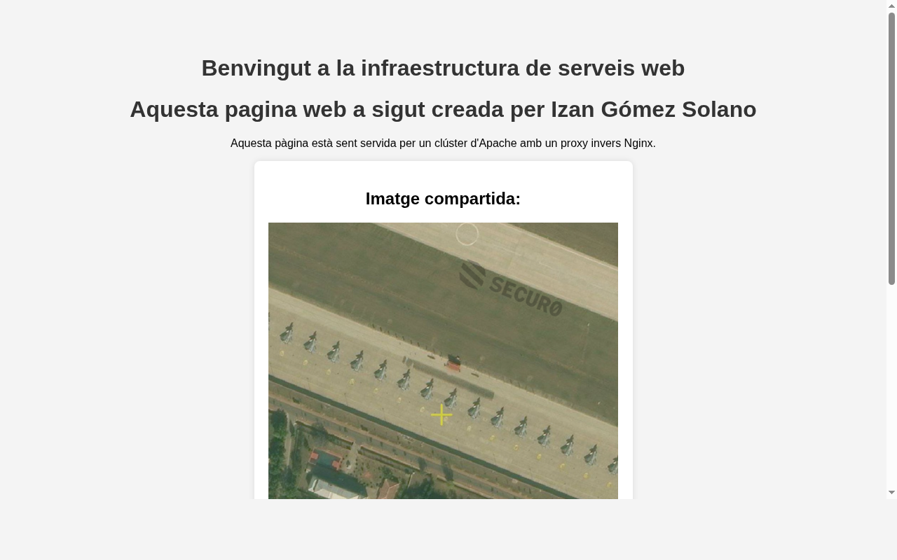
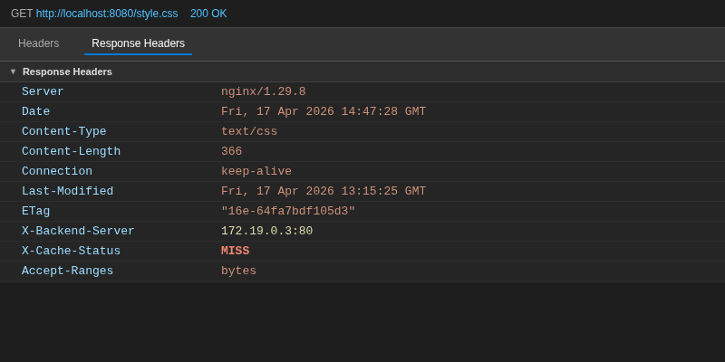
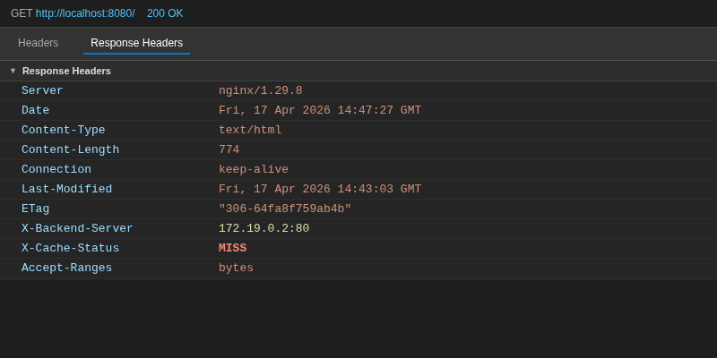
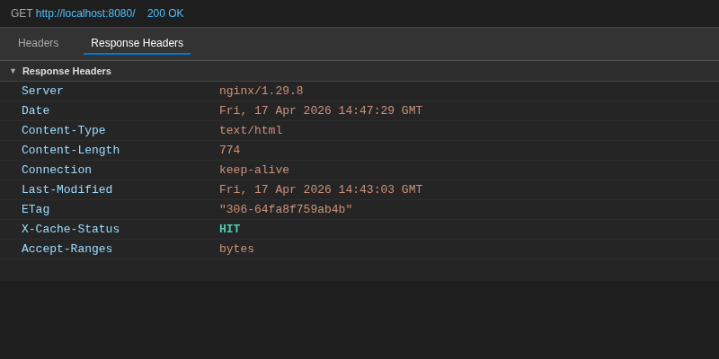

# Pràctica: Proxies amb Nginx

**Autor:** Izan Gómez Solano

---

## Fase 1 i 2: Servidors Apache amb contingut web

He creat dos servidors Apache basats en la imatge `httpd:alpine`. Per compartir el contingut web entre els dos nodes sense duplicar fitxers, he configurat un volum local que apunta a la carpeta `./html/`. Qualsevol canvi que faig en els fitxers HTML, CSS o multimèdia es reflecteix automàticament en els dos servidors a la vegada, sense necessitat de reiniciar cap contenidor.

El contingut web inclou un `index.html`, un full d'estils `style.css`, una imatge i un vídeo de prova generat amb `ffmpeg`.

**Problema trobat:** Inicialment vaig crear el fitxer de vídeo amb `touch`, però el navegador no el reproduïa perquè estava buit. Ho vaig solucionar generant un vídeo real amb el comandament:
```bash
ffmpeg -f lavfi -i testsrc=duration=5:size=640x360:rate=30 -c:v libx264 html/video.mp4
```



---

## Fase 3: Volum compartit entre nodes

Els dos contenidors Apache munten la mateixa carpeta del host a `/usr/local/apache2/htdocs/`. Per demostrar que el volum compartit funciona, vaig modificar el text del `index.html` i vaig comprovar que el canvi es veia immediatament en els dos nodes sense reiniciar res.


---

## Fase 4: Proxy invers i Balanceig Round Robin

He configurat Nginx com a punt d'entrada únic al port 8080. Al fitxer `nginx/default.conf` he definit un bloc `upstream` amb els dos servidors Apache. Nginx utilitza Round Robin per defecte, repartint les peticions de forma alterna entre els dos nodes.

Per poder verificar quin servidor respon a cada petició, he afegit la capçalera personalitzada `X-Backend-Server` a totes les respostes:

```nginx
add_header X-Backend-Server $upstream_addr;
```

Gràcies a això puc veure l'adreça IP del servidor Apache que ha atès cada petició. A la primera petició respon `172.19.0.2` (apache1):


A la següent petició a un recurs diferent respon `172.19.0.3` (apache2), confirmant l'alternança Round Robin:



---

## Fase 5: Memòria cau (Proxy Cache)

He configurat una zona de caché anomenada `my_cache` al directori `/tmp/cache` dins del contenidor. He afegit la capçalera `X-Cache-Status` per veure l'estat de la caché en cada petició:

```nginx
add_header X-Cache-Status $upstream_cache_status;
```

El comportament esperat és:
- **Primera petició** → `MISS` (Nginx no té la resposta guardada, la demana a l'Apache)
- **Peticions següents** → `HIT` (Nginx retorna la resposta guardada sense contactar l'Apache)

**Problema trobat:** La caché sempre mostrava `MISS`. Investigant els logs del contenidor vaig trobar l'error:
```
chmod() "/var/cache/nginx/proxy_temp/..." failed (1: Operation not permitted)
```
Nginx intentava escriure fitxers temporals a `/var/cache/nginx/proxy_temp/` però el procés worker no tenia permisos per fer `chmod` en aquell directori. Això feia que mai pogués desar res a la caché.

**Solució aplicada en dos passos:**

1. Afegit `use_temp_path=off` al `proxy_cache_path` perquè Nginx escrigui directament a `/tmp/cache` sense usar el directori temporal problemàtic:
```nginx
proxy_cache_path /tmp/cache levels=1:2 keys_zone=my_cache:10m max_size=100m inactive=60m use_temp_path=off;
```

2. Creat un fitxer `nginx/nginx.conf` personalitzat amb `user root;` i muntat al contenidor, eliminant la restricció de permisos sobre el directori de caché.

Després d'aplicar els dos canvis i reiniciar el contenidor, la primera petició retorna `MISS`:



I les peticions següents retornen `HIT` (nota: `X-Backend-Server` desapareix en HIT perquè Nginx no contacta cap backend):



---

## Fitxers de configuració finals

**`docker-compose.yml`**
```yaml
version: '3.8'

services:
  apache1:
    image: httpd:alpine
    container_name: apache1
    volumes:
      - ./html:/usr/local/apache2/htdocs/
    networks:
      - xarxa_practica

  apache2:
    image: httpd:alpine
    container_name: apache2
    volumes:
      - ./html:/usr/local/apache2/htdocs/
    networks:
      - xarxa_practica

  nginx_proxy:
    image: nginx:alpine
    container_name: nginx_proxy
    ports:
      - "8080:80"
    volumes:
      - ./nginx/nginx.conf:/etc/nginx/nginx.conf:ro
      - ./nginx/default.conf:/etc/nginx/conf.d/default.conf:ro
    depends_on:
      - apache1
      - apache2
    networks:
      - xarxa_practica

networks:
  xarxa_practica:
    driver: bridge
```

**`nginx/default.conf`**
```nginx
proxy_cache_path /tmp/cache levels=1:2 keys_zone=my_cache:10m max_size=100m inactive=60m use_temp_path=off;

upstream backends {
    server apache1:80;
    server apache2:80;
}

server {
    listen 80;

    location / {
        proxy_pass http://backends;

        add_header X-Backend-Server $upstream_addr;
        add_header X-Cache-Status $upstream_cache_status;

        proxy_cache my_cache;
        proxy_cache_key "$scheme$proxy_host$request_uri";
        proxy_cache_valid 200 60m;

        proxy_ignore_headers Cache-Control Expires Set-Cookie Vary;
        proxy_hide_header Set-Cookie;
        proxy_buffering on;
    }
}
```
